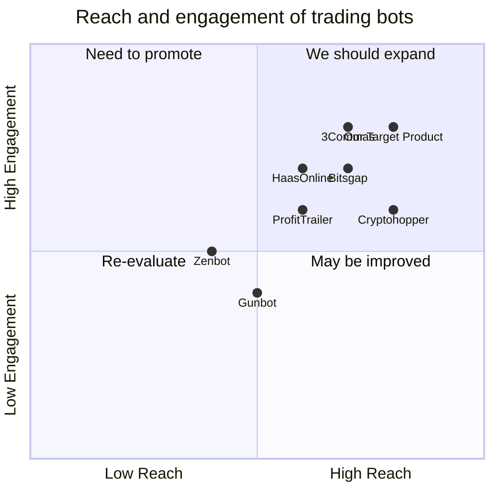

## Original Requirements:
The boss wants to create an advanced trading bot for Binance Futures.

## Product Goals:
```python
[
    "Create a highly efficient and profitable trading bot for Binance Futures",
    "Provide advanced trading features and strategies",
    "Maximize user's trading profits and minimize risks"
]
```

## User Stories:
```python
[
    "As a user, I want to be able to set custom trading strategies for the bot",
    "As a user, I want the bot to automatically execute trades based on market conditions",
    "As a user, I want to be able to monitor the bot's performance and adjust settings if needed",
    "As a user, I want the bot to provide real-time market data and analysis",
    "As a user, I want the bot to have a user-friendly interface and easy setup process"
]
```

## Competitive Analysis:
```python
[
    "3Commas: A popular trading bot with a wide range of features",
    "HaasOnline: Offers advanced trading strategies and customizable bots",
    "Cryptohopper: Provides automated trading and portfolio management",
    "Zenbot: A free and open-source trading bot with customizable strategies",
    "Gunbot: Offers a variety of trading strategies and supports multiple exchanges",
    "ProfitTrailer: Focuses on cryptocurrency trading with advanced features",
    "Bitsgap: Provides automated trading and portfolio management"
]
```

## Competitive Quadrant Chart:


## Requirement Analysis:
The product should be a highly efficient and profitable trading bot for Binance Futures. It should provide advanced trading features and strategies to maximize user's trading profits and minimize risks. The bot should be able to execute trades automatically based on market conditions and allow users to set custom trading strategies. It should also provide real-time market data and analysis, as well as a user-friendly interface and easy setup process.

## Requirement Pool:
```python
[
    ("Support for multiple trading pairs", "P0"),
    ("Integration with Binance Futures API", "P0"),
    ("Advanced order types (stop-loss, take-profit, trailing stop)", "P1"),
    ("Backtesting functionality for trading strategies", "P1"),
    ("Risk management features (position sizing, risk/reward ratio)", "P2")
]
```

## UI Design draft:
The UI should have a clean and intuitive design. It should include the following elements:
- Dashboard: Displaying real-time market data, account balance, and bot performance.
- Trading Strategies: Allow users to set custom trading strategies and parameters.
- Order Management: Displaying open orders, executed trades, and order history.
- Settings: Allow users to adjust bot settings, risk management features, and API integration.
- Notifications: Provide alerts and notifications for important events and market conditions.

The UI should have a modern and professional style, with a responsive layout that adapts to different screen sizes.

## Anything UNCLEAR:
There are no unclear points.