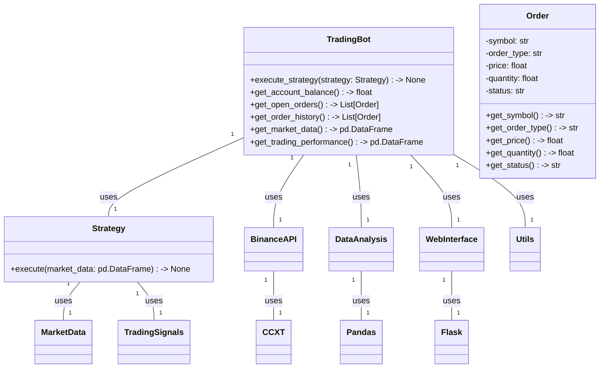
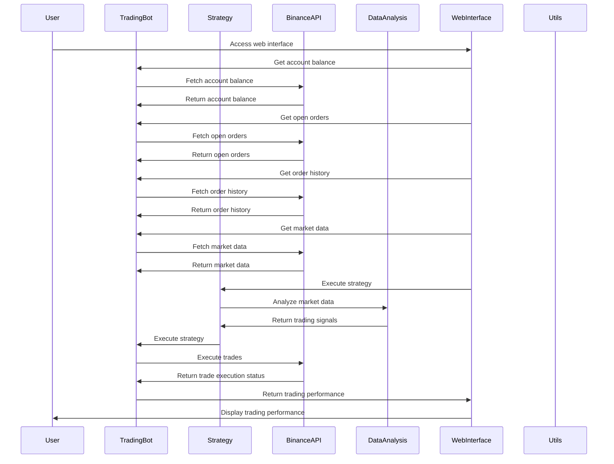

## Implementation approach:
To create a highly efficient and profitable trading bot for Binance Futures, we will use the following open-source tools and frameworks:

1. Binance API: We will integrate with the Binance Futures API to fetch real-time market data, execute trades, and manage account balances.

2. CCXT: CCXT is a popular open-source cryptocurrency trading library that provides a unified API for interacting with multiple exchanges, including Binance. We will use CCXT to simplify the integration with the Binance API and handle the trading logic.

3. Pandas: Pandas is a powerful open-source data analysis and manipulation library. We will use Pandas to perform data analysis on the market data and generate trading signals based on custom strategies.

4. Matplotlib: Matplotlib is a widely-used open-source plotting library. We will use Matplotlib to visualize the market data, trading performance, and other relevant metrics.

5. Flask: Flask is a lightweight open-source web framework for building APIs. We will use Flask to create a user-friendly web interface for the trading bot, allowing users to monitor performance, adjust settings, and view real-time market data.

By leveraging these open-source tools, we can build a robust and efficient trading bot that meets the requirements and provides advanced trading features and strategies.

## Python package name:
```python
"binance_trading_bot"
```

## File list:
```python
[
    "main.py",
    "bot.py",
    "strategies.py",
    "api.py",
    "data_analysis.py",
    "web_interface.py",
    "utils.py"
]
```

## Data structures and interface definitions:


## Program call flow:


## Anything UNCLEAR:
The requirements are clear and there are no unclear points.